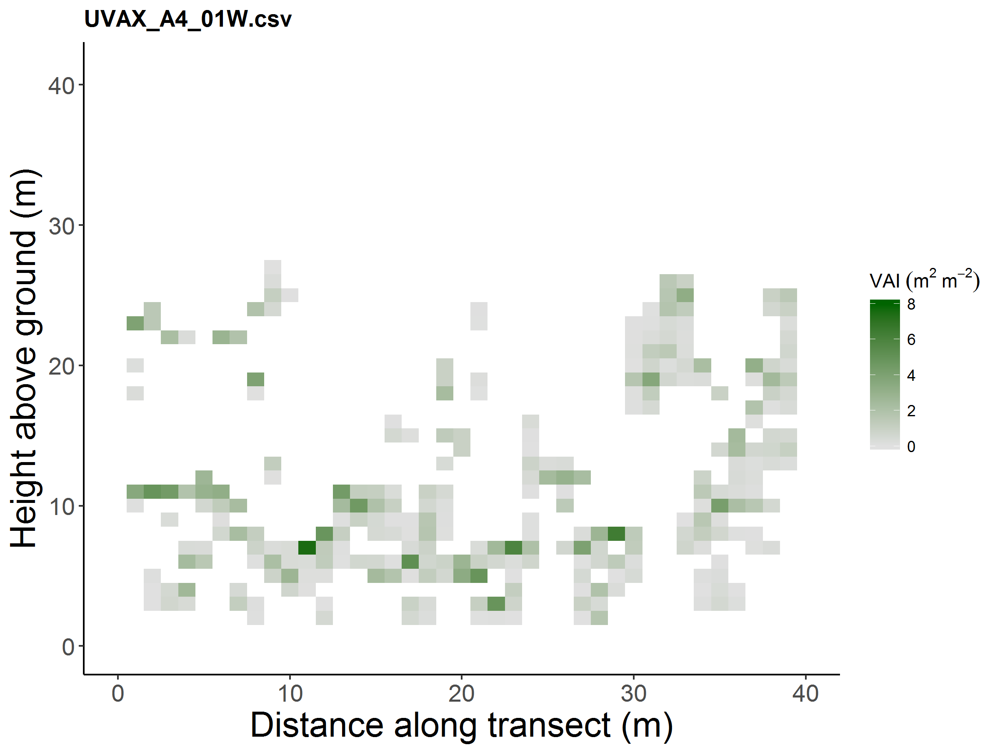
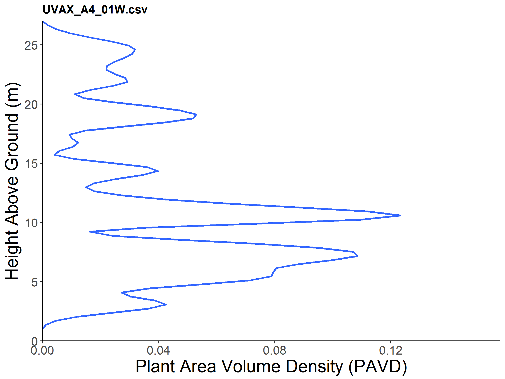
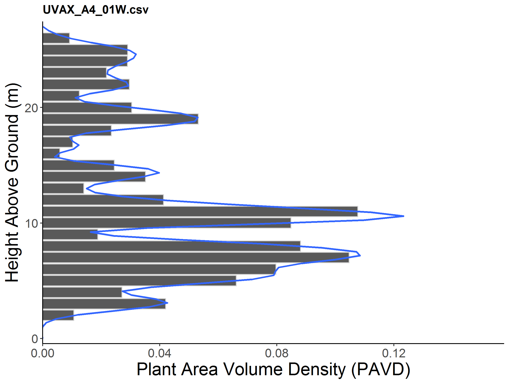

```{r setup, include = FALSE}
knitr::opts_chunk$set(
  collapse = TRUE,
  comment = "#>"
)
```

his vignette is aimed at those working with portable canopy LiDAR (PCL) data. Raw PCL data is most typically stored in comma separated values (.csv) files that contain a series of ASCII strings of return distances and return intensities. These return distances are interspersed with data markers that correspond to known distance measures on the ground as described in Hardiman et al. (2013). The spacing between these markers, typically at 10 m, is used as an input into the forestr processing algorithm (Atkins et al. in review). 

This vignette will walk you through how to analyze a PCL or portable canopy LiDAR file in two ways:  1) an automated way using the `process_pcl` function; and 2) by processing the file step-by-step.

The `process_pcl` function has the advantage that all of the output from the file is written to disk in an output directory that is created in the working directory which you can access via 'get_wd()' in your console. Approaching the problem step-by-step allows you to keep sections of the process in the workspace, but is more cumbersome and is not recommended as all relevant files are written to the output directory and can be worked with seperatly if so desired. 

## Using `process_pcl`

To analyze a single PCL transect, call the function `process_pcl` with the following information:

* `marker.spacing` is the distance between markers in the dataset (default is 10 meters). In PCL data, data markers which are default values below -9999 in the code, indicate the end of defined sections along the transect. 

* `user_height` is the offset, based on the user's own height differences and directly refers to the distance of the front portion of the laser from the ground. The value is added to all the distances in the data set.

* `max.vai` is the maximum vegetation area index at the 1 x 1 meter scale that is used to adjust sections of the data under saturated conditions (i.e. when the LiDAR fails to penetrate the canopy and records only canopy hits). A default value of 8 is used and has been found to be well-representative for a broad selection of forests.

* `pavd` and `hist` refers to the plant area volume density graph with histogram option. If `pavd` is set to TRUE, a plot will be written to the output folder. If `hist` is set to TRUE, a histogram will be superimposed over the PAVD curve.


The `process_pcl` will print multiple CSC metrics to the screen, including canopy rugosity, rumple, porosity, etc., but will also create an output directory named output within the working directory where it will store four things:

1.  The Summary Matrix - a .csv file of columnar values of mean leaf heigh, maximum height, vegetation area index (VAI), etc.
2.  The Hit Matrix - a .csv file containing VAI by rows where each row correpsonds to the x, z position of VAI in the canopy.
3.  The Output File - this is a .csv file that contains all CSC metrics in output form.
4.  The Hit Grid - this is a PNG image file of the vertical hit grid as explained in Hardiman et al. (2013) and is a graphic representation of the vertical distribution of leaf density throughout the canopy. This can be recreated and modified using the source code with the Hit Matrix file as the input.


```{r, fig.show='hold'}
require(forestr)
# Link to stored, raw PCL data in .csv form
uva.pcl <- system.file("extdata", "UVAX_A4_01W.csv", package = "forestr")

# Run process complete PCL transect, store output to disk
process_pcl(uva.pcl, marker.spacing = 10, user_height = 1.05, max.vai = 8, pavd = TRUE, hist = TRUE)
```

## Graphing capabilities

`process_pcl` creates two types of figures:

{width=500px}


{width=500px}

{width=500px}


